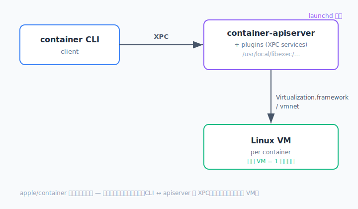
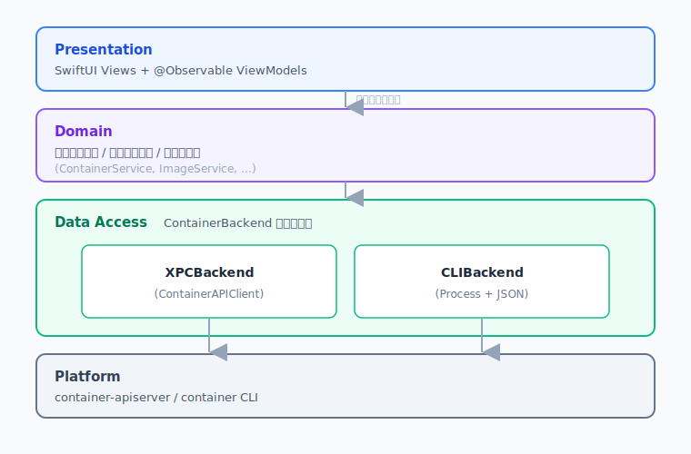
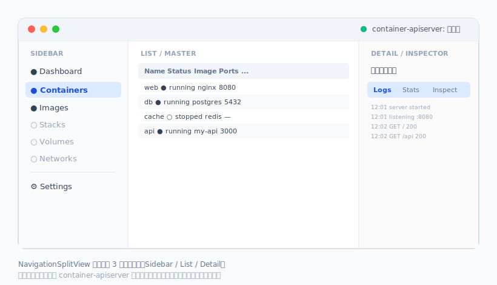

# Apple Container Desktop — 設計ドキュメント（v0.1 ドラフト）

> Apple の [`container`](https://github.com/apple/container)（1.0.0, 2025）を基盤とした、macOS ネイティブのデスクトップ GUI アプリケーション。Swift / SwiftUI で実装する OSS プロジェクト。

---

## 0. プロジェクト概要

| 項目       | 内容                                                                     |
| ---------- | ------------------------------------------------------------------------ |
| 名称 | **Rookery**（🐧 ペンギンの集団繁殖地＝多数のコンテナが集うホストの比喩）                   |
| 種別       | macOS ネイティブ デスクトップアプリ（OSS）                               |
| 言語 / UI  | Swift 6 / SwiftUI（必要箇所のみ AppKit ブリッジ）                        |
| 動作要件   | **macOS 26 以降 / Apple silicon 専用**（`apple/container` の制約に準拠） |
| ライセンス | Apache-2.0（`apple/container` と整合させ、依存取り込みを容易にする想定） |
| 基盤       | `apple/container` 1.0.0+（`container-apiserver` + `ContainerAPIClient`） |

### 立ち位置（差別化方針）

先行する Swift 製 GUI [Orchard](https://github.com/andrew-waters/orchard) が既に存在し、コンテナ/イメージ/ネットワークの一覧・操作・ログ・統計などの「管理 GUI」機能を網羅しつつある。本プロジェクトは **管理 GUI の再実装ではなく、「開発者ワークフロー統合」を軸に差別化** する。

差別化の柱（詳細は §7）:

1. **Stacks（Compose 風の宣言的マルチコンテナ）** — `apple/container` 自体は Compose 非対応。YAML で複数コンテナ + ネットワーク + ボリュームをひとまとめに定義・起動・破棄できる体験を GUI から提供する。
2. **開発者ワークフロー第一** — ポートフォワード/ボリュームマウント/環境変数を GUI で組み立て、「もう一度同じ条件で起動」「設定を Stack 化」までを一気通貫にする。
3. **優れたオンボーディング** — `apple/container` 本体の導入・`system start`・kernel セットアップを GUI が検知・ガイド・自動化する（ゼロコンフィグ起動）。
4. **日本語ファースト + i18n** — UI を最初から多言語対応（ja/en）で設計。

---

## 1. 対象基盤（`apple/container`）の理解

設計の前提として、基盤の構造を整理する。

### 1.1 アーキテクチャ

`apple/container` は**クライアント・サーバ型**:



- **`container-apiserver`**: launchd で管理されるバックエンドサービス。`/usr/local/libexec/container/plugins` 配下の XPC サービス（プラグイン）を起動する。
- **IPC**: CLI ↔ apiserver 間は **XPC**。1.0.0 で v0 系 XPC API の互換は削除済み。
- **`ContainerAPIClient`**: apiserver と XPC で通信する **Swift ライブラリ**。コンテナ/イメージ/ネットワーク/システム操作の型付き API を提供し、CLI を介さず利用可能。
- **基盤フレームワーク**: Virtualization.framework（軽量 VM）、vmnet（仮想ネットワーク）、Keychain（レジストリ資格情報）、Unified Logging（ログ）、launchd（サービス管理）。
- **イメージ**: OCI 互換（標準レジストリと相互運用）。

### 1.2 連携可能な API 面

| 操作領域                                                     | XPC（`ContainerAPIClient`） | CLI（`container ...`） |
| ------------------------------------------------------------ | --------------------------- | ---------------------- |
| コンテナ list/start/stop/kill/delete/exec/logs/stats/inspect | ✅ 想定可                    | ✅                      |
| イメージ list/pull/push/tag/delete/inspect                   | ✅ 想定可                    | ✅                      |
| ネットワーク CRUD/inspect                                    | ✅ 想定可                    | ✅                      |
| ボリューム CRUD/inspect                                      | △（要検証）                 | ✅                      |
| **system start/stop/status**                                 | ❌ 未公開                    | ✅（CLI 必須）          |
| **builder（BuildKit）start/stop/status**                     | ❌ 未公開                    | ✅                      |
| **DNS domain / system property / kernel set**                | ❌ 未公開                    | ✅                      |
| **build（Dockerfile）**                                      | ❌（BuildKit 経由）          | ✅                      |
| registry login/logout/list                                   | △                           | ✅                      |

> Orchard も同じ「XPC 主軸 + 一部 CLI」のハイブリッドを採用している。**system/builder/DNS/property/kernel は当面 CLI 呼び出しが必須**という事実が、§2 のアーキテクチャ設計を規定する。

### 1.3 主要 CLI サブコマンド（GUI でラップ対象）

<!-- textlint-disable ja-technical-writing/sentence-length -->

- `container run / create / start / stop / kill / rm(delete) / ls(list) / exec / logs / stats / inspect / cp / export / prune`
- `container image pull / push / ls / save / load / tag / rm / inspect / prune`
- `container build`（BuildKit, `-t` `-f` `--build-arg` `--target`）
- `container network create/delete/prune/list/inspect`
- `container volume create/delete/prune/list/inspect`
- `container registry login/logout/list`
- `container system start/stop/status/version/logs/df/dns/kernel/property`
- `container builder start/stop/status/delete`

<!-- textlint-enable ja-technical-writing/sentence-length -->

多くのコマンドは `--format json|yaml|toml` 出力に対応しており、**CLI フォールバック時は JSON 出力をパースする**方針が取れる。

---

## 2. アプリケーションアーキテクチャ

### 2.1 レイヤ構成

クリーンな依存方向（上位 → 下位の一方向）を保つ。



### 2.2 ハイブリッド連携の抽象化（最重要設計）

ハイブリッド方式を破綻なく扱うため、**機能ごとに最適なバックエンドへルーティングするファサード**を置く。UI/Domain 層は、内部で XPC と CLI のどちらが使われるかを一切意識しない。

```swift
// 全操作を表す統一プロトコル（Domain 層が依存する唯一の口）
protocol ContainerBackend: Sendable {
    // コンテナ
    func listContainers() async throws -> [Container]
    func startContainer(id: String) async throws
    func stopContainer(id: String, signal: Signal) async throws
    func deleteContainer(id: String, force: Bool) async throws
    func logs(id: String, follow: Bool) -> AsyncThrowingStream<LogLine, Error>
    func exec(id: String, cmd: [String]) async throws -> ExecSession   // PTY
    func stats(id: String) -> AsyncThrowingStream<ContainerStats, Error>
    // イメージ
    func listImages() async throws -> [Image]
    func pullImage(ref: String, progress: @escaping (PullProgress) -> Void) async throws
    func buildImage(spec: BuildSpec, progress: ...) async throws -> Image
    // システム（CLI 必須）
    func systemStatus() async throws -> SystemStatus
    func systemStart() async throws
    // ...
}

// ルーティングするファサード
final class HybridBackend: ContainerBackend {
    private let xpc: XPCBackend       // ContainerAPIClient ラッパ
    private let cli: CLIBackend       // Process + JSON パーサ

    // XPC 優先、未公開/失敗時は CLI フォールバック
    func listContainers() async throws -> [Container] {
        do { return try await xpc.listContainers() }
        catch BackendError.unsupported { return try await cli.listContainers() }
    }
    // system 系は最初から CLI
    func systemStatus() async throws -> SystemStatus { try await cli.systemStatus() }
}
```

設計上のポイント:

- **`ContainerBackend` が唯一の境界**。XPC API が将来拡張されたら `HybridBackend` のルーティングを変えるだけで UI 影響ゼロ。
- **DTO とドメインモデルを分離**。XPC 戻り値・CLI JSON はそれぞれ Decodable DTO に落とし、`Container`/`Image` 等のドメインモデルへマッピングする。両経路で同一モデルに収束させる。
- **テスト容易性**: `ContainerBackend` のモック実装で UI を SwiftUI Preview / ユニットテストから駆動できる。

### 2.3 CLIBackend の実装方針

- `Foundation.Process` で `container` バイナリを起動。`--format json` を付与して構造化出力をパース。
- バイナリパス解決: `/usr/local/bin/container` を既定とし、`which` / ユーザ設定で上書き可能に。
- 長時間ストリーム（`logs -f`, `stats`, `build`, `pull --progress`）は **`Process` の stdout を `AsyncThrowingStream` でラップ** し、行/イベント単位で UI へ供給。
- exec はターミナル（PTY）が必要 → §5 で詳述。
- エラーは exit code + stderr を `BackendError` に正規化。

### 2.4 並行性 / 状態管理

- Swift 6 strict concurrency 準拠（`Sendable`、actor 分離）。
- バックエンドアクセスは **actor** で直列化し、競合とデータ競合を防ぐ。
- UI 状態は `@Observable`（Observation フレームワーク）ViewModel。
- 一覧の自動更新は **ポーリング（既定 2–5s, 設定可）**。XPC のイベント購読が可能か要検証（可能ならイベント駆動へ移行）。

---

## 3. モジュール / プロジェクト構成

Swift Package Manager ベースの**マルチモジュール構成**（Xcode プロジェクトは薄いシェル）。

```sh
apple-container-for-desktop/
├── App/                      # Xcode app target (薄いシェル, entitlements, Info.plist)
│   └── RookeryApp.swift
├── Packages/
│   ├── Backend/              # ContainerBackend, XPCBackend, CLIBackend, HybridBackend
│   ├── Domain/               # エンティティ, ユースケース, プロトコル
│   ├── Features/             # 機能別 SwiftUI モジュール
│   │   ├── Containers/
│   │   ├── Images/
│   │   ├── Stacks/           # 差別化機能（Phase 2）
│   │   └── Onboarding/
│   ├── DesignSystem/         # 共通 UI コンポーネント, カラー, アイコン
│   └── Core/                 # ロギング, 設定, i18n, Process ユーティリティ
├── docs/
│   └── DESIGN.md             # 本書
└── Package.swift
```

依存方向: `App → Features → Domain → Backend → Core`。`Features` 間は疎結合（共有は `Domain`/`DesignSystem` 経由）。

---

## 4. 画面設計（MVP: コンテナ + イメージ）

### 4.1 全体レイアウト

`NavigationSplitView` ベースの 3 ペイン（Docker Desktop 風）:



メニューバー常駐（status item）も提供し、apiserver 状態・実行中コンテナ数を一目で確認可能に（Phase 2）。

### 4.2 コンテナ画面（MVP 必須）

- **一覧**: 名前 / 状態 / イメージ / ポート / CPU・MEM（stats）/ 起動時刻。状態バッジ（running/stopped/exited）、フィルタ・検索・ソート。
- **行アクション**: Start / Stop / Restart / Kill / Delete（force 確認）、ターミナル(exec)、ログ。
- **詳細インスペクタ（タブ）**:
  - **Logs**: ストリーミング表示、フィルタ、follow、自動スクロール、コピー/保存。
  - **Stats**: CPU / メモリ / ネットワーク I/O のリアルタイムグラフ。
  - **Inspect**: 構成 JSON のツリー表示。
  - **Terminal**: `exec` による対話シェル（§5）。
  - **Files**（任意/Phase 2）: `cp` を使ったファイル取り出し。
- **新規起動シート**: イメージ選択 → ポート/環境変数/ボリューム/CPU・MEM/`--init` をフォーム入力 → run/create。**ここで作った設定を「Stack 化」できる導線**を置く（差別化の起点）。

### 4.3 イメージ画面（MVP 必須）

- **一覧**: リポジトリ:タグ / イメージ ID / サイズ / 作成日時。dangling フィルタ。
- **アクション**: Pull（レジストリ検索 + 進捗バー）、この image から Run、Tag、Delete、Inspect、Prune。
- **Build**: Dockerfile 選択 + コンテキスト + タグ + build-arg をフォーム化し `container build` 実行（ログストリーム表示）。builder 未起動なら自動起動を促す。
- **Push**: タグ指定 + レジストリ資格情報（Keychain 連携、`registry login`）。

### 4.4 オンボーディング / システム状態（差別化・常時表示）

- 初回起動時に **`container` バイナリの有無** と **apiserver の稼働状態** を検査。
- 未導入なら導入手順を案内（GitHub Releases へのリンク。将来は pkg ダウンロード補助）。
- apiserver 停止中なら **ワンクリック `system start`**。kernel 未設定なら `system kernel set --recommended` を案内。
- これにより「インストール直後に何も動かない」典型的なつまずきを解消する。

---

## 5. 技術的な要注意ポイント

| 項目                                 | 課題                                                                                   | 方針                                                                                                              |
| ------------------------------------ | -------------------------------------------------------------------------------------- | ----------------------------------------------------------------------------------------------------------------- |
| **App Sandbox**                      | apiserver への XPC 接続・`container` バイナリ実行・Process 起動は Sandbox と相性が悪い | **当面 Sandbox 無効**で配布（Developer ID 直配布）。Mac App Store は対象外と割り切る。entitlements を最小限に設計 |
| **ContainerAPIClient の API 安定性** | 公開 Swift API だが仕様変動の可能性。XPC v0 互換は 1.0.0 で削除済み                    | バージョン固定で取り込み、`HybridBackend` で吸収。API 不一致時は CLI フォールバック                               |
| **exec のターミナル**                | PTY が必要。SwiftUI に端末エミュレータは無い                                           | **SwiftTerm**（OSS, MIT）を採用。`container exec -it` を PTY で接続。代替: 自前 PTY 最小実装                      |
| **ストリーミング**                   | logs/stats/build/pull の進捗を UI に流す                                               | `Process` stdout → `AsyncThrowingStream`。XPC 側にストリーム API があれば優先                                     |
| **権限・署名**                       | apiserver 連携・配布                                                                   | Developer ID 署名 + notarization。CI で自動化                                                                     |
| **macOS 26 専用**                    | 開発・CI 環境の確保                                                                    | CI は macOS 26 runner（GitHub Actions の対応状況を要確認）                                                        |
| **多数 VM の負荷**                   | コンテナ = VM のため stats ポーリングが重い可能性                                      | ポーリング間隔の調整・表示中コンテナのみ購読                                                                      |

---

## 6. ロードマップ（フェーズ分割）

### Phase 0 — 基盤づくり（1〜2 週）
- SPM マルチモジュール骨格、Xcode app target、CI（ビルド/lint/test）。
- `ContainerBackend` プロトコル定義 + **モックバックエンド**（UI を実機なしで開発可能に）。
- `CLIBackend` の最小実装（`ls --format json` で疎通確認）。

### Phase 1 — MVP（コンテナ + イメージ）★今回スコープ
- システム状態検知 + オンボーディング（`system start` 連携）。
- コンテナ一覧/操作/ログ/stats/inspect/terminal(exec)。
- イメージ一覧/pull/build/tag/delete/run。
- `XPCBackend`（`ContainerAPIClient`）を list 系から段階導入し、`HybridBackend` で統合。
- ja/en ローカライズ。Developer ID 署名 + notarization で初回リリース。

### Phase 2 — 差別化機能
- **Stacks（Compose 風）**: YAML スキーマ定義、起動/破棄、依存順制御、Stack エディタ GUI。
- ネットワーク / ボリューム管理 UI。
- メニューバー常駐、レジストリ管理、kernel/property 設定 GUI。

### Phase 3 — 発展
- ダッシュボード（リソース全体可視化）、テンプレート/お気に入り、`cp` ファイルブラウザ、英語以外の i18n 拡充、自動更新。

---

## 7. 差別化機能の詳細: Stacks（Compose 風）

`apple/container` には Compose 相当が無い。これを GUI 主導で埋めるのが最大の差別化。

```yaml
# rookery-stack.yaml（独自スキーマ。将来 compose 互換サブセット取り込みも検討）
name: my-web-app
services:
  db:
    image: postgres:16
    env: { POSTGRES_PASSWORD: dev }
    volumes: [ "pgdata:/var/lib/postgresql/data" ]
  api:
    image: my-api:latest
    ports: [ "8080:8080" ]
    depends_on: [ db ]
volumes:
  pgdata: {}
networks:
  default: {}
```

- GUI で services を追加・編集 → 「Up」で `container network/volume create` + 各 `container run` を依存順に実行。
- 「Down」で逆順に停止・削除。状態を Stack 単位でまとめて表示。
- 既存の単発コンテナ起動設定（§4.2）を **「Stack に保存」** できる導線で、自然に宣言的構成へ誘導する。

> 注: compose 完全互換は目標にせず、まずは「複数コンテナをまとめて再現可能に起動できる」最小価値を狙う。

---

## 8. 未確定事項 / 次アクションで検証すべきこと

1. **`ContainerAPIClient` の正確な API 形**（パッケージ取り込み方法、公開型、認証/接続手順）→ `apple/container` のソースで要確認。
2. **XPC でのストリーミング/イベント購読の可否**（logs/stats をポーリングせず購読できるか）。
3. **ボリューム/ネットワーク/registry の XPC 公開状況**（CLI 必須範囲の確定）。
4. **macOS 26 CI ランナーの入手性**（GitHub Actions / セルフホスト）。
5. ~~プロジェクト名の確定~~ → **Rookery に確定**（🐧 ペンギンの集団繁殖地＝多数のコンテナが集うホストの比喩）。
6. **SwiftTerm 採用可否**の PoC（exec ターミナル）。

---

## 付録 A: 技術スタック一覧

| 領域       | 採用                                                 |
| ---------- | ---------------------------------------------------- |
| 言語       | Swift 6（strict concurrency）                        |
| UI         | SwiftUI + 一部 AppKit（NSViewRepresentable）         |
| 端末       | SwiftTerm（候補）                                    |
| 連携       | ContainerAPIClient（XPC）+ Foundation.Process（CLI） |
| 並行性     | async/await, actor, AsyncStream, Observation         |
| パッケージ | Swift Package Manager（マルチモジュール）            |
| テスト     | Swift Testing / XCTest + モックバックエンド          |
| CI/CD      | GitHub Actions（build/lint/test/sign/notarize）      |
| Lint       | SwiftLint / SwiftFormat                              |
| ライセンス | Apache-2.0（予定）                                   |
